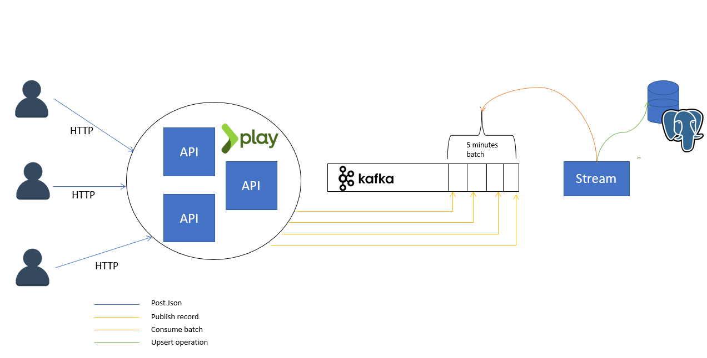

## DEVICE COLLECTOR API

## Summary
<!-- START doctoc generated TOC please keep comment here to allow auto update -->
<!-- DON'T EDIT THIS SECTION, INSTEAD RE-RUN doctoc TO UPDATE -->


- [DEVICE-COLLECTOR-API](#DEVICE-COLLECTOR-API)
  - [Context](#Context)
  - [Description](#Description)
  - [Routes](#Routes)
  - [Pipeline](#Pipeline)
  - [Problems](#Problems)
  - [Solutions](#Solutions)

<!-- END doctoc generated TOC please keep comment here to allow auto update -->

## Context
Each device (computer, smartphone, smart TV...) playing a Streamroot-powered video sends statistics to our data pipeline. That data is sent by each device through HTTP as **JSON payloads**. Each device sends one payload **every 30 seconds**.
The content of each payload is described below : 
```
{
    "token" : "c98arf53-ae39-4c9d-af44-c6957ee2f748",
    "customer": "Customer1",
    "content": "channel1",
    "timespan": 30000,
    "p2p": 560065,
    "cdn": 321123,
    "sessionDuration": 120000,
}
```
## Description
This API receive Http Json Payload, store and aggregate in cache, and then using a schedular, send data to Database each 5 minutes

                                     [POSTGRES]
                                          ⋀                                       
                                          ⋁              
                              **************************
                              *                        *
              [device]   ->   *  DEVICE-COLLECTOR-UDS  * -> [response]
                              *                        *
                              **************************
              -> request/response
              < >: external calls

## Routes
### Technical Route
- `/_healthcheck` : Check if API is running.

### API V1
- `/api/v1/stats` : Receive data, aggregate, cache it in memory and send it to DB each 5 minutes


## Pipeline
Before lauching the pipeline, make sure to have docker and sbt installed
To launch pipeline : ./pipeline.sh
Otherwise, use ./pipeline.sh simple, it will launch a preassmblied version of the API

```yaml
pipeline:
  1- test application
  2- build and assembly RPM
  3- build image
  4- launch API and DB
  5- Check http://localhost:9001
```


## Problems

### Concurrency and Consistency
- the first problem encountered was how to deal with concurrency and data consistency when storing data in a shared mutubale cache. 
  Semaphore was a primitive but costly solution

### Memory
- the second problem was how the cache will deal with the increasing http request with time. if we have a huge volume of data, the Sever RAM wont be able to store all the data

### Scalability
- if we want to handle more users, and more data, distributing the API is a solution, but how can we manage the consistency of data if each instance have its own memory cache, such as the schedular 

## Solutions
### Actor Model
- to resolve semaphore and Lock problem, we can use an actor system (akka) such as described below

### Distributed cache database: Reddis
- to assure distribured data consistency and to handle the volume of a data, a Distributed Cache dataBase such as Reddis cane be an answer

### ElasticSearch
- ElasticSearch is another option to aggregate all the data stored

### Kafka
- using windowed kafka, we can use kafka and an event-driven architecture to provide a scalable, real-time solution

